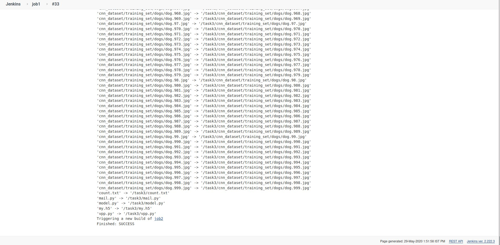

## In Machine Learning need to change the model several times to find the best accuracy model manually. So this required lots of efforts and time for making a machine learning model precisely. so there's is obvious need to automate all this process of tweaking the code and retesting until the model gives a good level of accuracy .So here comes the role of Devops , Using Devops we can automate all these so it will save a lot of time and the developer can work on other project with a free mind.

## I am using jenkins for automation,github for deployment our code,and docker image for trainig our model.
## Before going to problem statement i need Docker image for trainig my model . this image depend on our model. In the my case i train a deep learning model so i need my image contain some deep learing modules. so i create Dockerfile for creating my custom image.Here i am creating 6 jobs for automation and for visual i use  build pipeline plugin

##

## PROBLEM STATEMENT :
### JOB 1 : Pull  the Github repo automatically when some developers push repo to Github

### Job2 : By looking at the code or program file, Jenkins should automatically start the respective machine learning software installed interpreter install image container to deploy code  and start training( eg. If code uses CNN, then Jenkins should start the container that has already installed all the softwares required for the cnn processing).

### Job3 : Train your model and predict accuracy or metrics.

### Job4 : if metrics accuracy is less than 80%  , then tweak the machine learning model architecture.
### Job5 : Retrain the model or notify that the best model is being created

### Job6 : Create One extra job job6 for monitor : If container where app is running. fails due to any reason then this job should automatically start the container again from where the last trained model left

# EXPLANATION
## JOB 1:-
#### Created a job named job1 for retrive the data from github ,the developer when commits it pushes to github automatically using git post-commit hook and github webhook triggered job job1 is pull the data from the github and store in the task3 directory. in case directory alredy created then rm the directory and make new directory and store the github data.

### Pull the data from github repo.

### Copy github pull data in local task3 directory

### After running job1

## JOB 2:-
#### I creat a job2. this job2 trigger when job1 succesfully run. in this job check the python code according to our code create a container let suppose in the my code i use  keras module so keras use for deep learning model training . so  i use grep command for grep keras if keras is grep then it give the exit code 0 so it mean in the our code we use keras .  it run the deep learning container . here we use two condition when if the  keras is grep then run the deep learning container else run the machine learing container but here i use same image for machine learning and deep learning model  both. 

### Trigger when job1 succesfully run

### For creating a container i use below script

### After succesfully run the job2

## JOB 3:-
####

##
