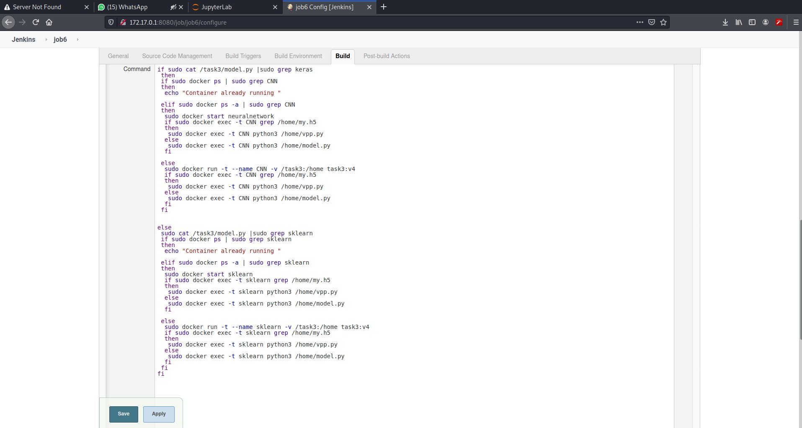

## In Machine Learning need to change the model several times to find the best accuracy model manually. So this required lots of efforts and time for making a machine learning model precisely. so there's is obvious need to automate all this process of tweaking the code and retesting until the model gives a good level of accuracy .So here comes the role of Devops , Using Devops we can automate all these so it will save a lot of time and the developer can work on other project with a free mind.

## I am using jenkins for automation,github for deployment our code,and docker image for trainig our model.
## Before going to problem statement i need Docker image for trainig my model . this image depend on our model. In the my case i train a deep learning model so i need my image contain some deep learing modules. so i create Dockerfile for creating my custom image.Here i am creating 6 jobs for automation and for visual i use  build pipeline plugin

##

## PROBLEM STATEMENT :
### JOB 1 : Pull  the Github repo automatically when some developers push repo to Github

### Job2 : By looking at the code or program file, Jenkins should automatically start the respective machine learning software installed interpreter install image container to deploy code  and start training( eg. If code uses CNN, then Jenkins should start the container that has already installed all the softwares required for the cnn processing).

### Job3 : Train your model and predict accuracy or metrics.

### Job4 : if metrics accuracy is less than 80%  , then tweak the machine learning model architecture.
### Job5 : Retrain the model or notify that the best model is being created

### Job6 : Create One extra job job6 for monitor : If container where app is running. fails due to any reason then this job should automatically start the container again from where the last trained model left

# EXPLANATION
## JOB 1:-
#### Created a job named job1 for retrive the data from github ,the developer when commits it pushes to github automatically using git post-commit hook and github webhook triggered job job1 is pull the data from the github and store in the task3 directory. in case directory alredy created then rm the directory and make new directory and store the github data.

### Pull the data from github repo.

### Copy github pull data in local task3 directory

### After running job1

## JOB 2:-
#### I creat a job2. this job2 trigger when job1 succesfully run. in this job check the python code according to our code create a container let suppose in the my code i use  keras module so keras use for deep learning model training . so  i use grep command for grep keras if keras is grep then it give the exit code 0 so it mean in the our code we use keras .  it run the deep learning container . here we use two condition when if the  keras is grep then run the deep learning container else run the machine learing container but here i use same image for machine learning and deep learning model  both. i mount the local directory with my docker container.so here i mount my task3 directory with my docker container /home directory for accessing the data.

### Trigger when job1 succesfully run

### For creating a container i use below script

### After succesfully run the job2

## JOB 3:-
#### I creat a job3 for training my model and this job3 run after job2 successfully run the container.so here i run my python model.py file in this file train the model and if the model accurcy is greater then 80% then it is save the accurcy and the trigger the job5. job5 is send the message with model accurcy to developer . so here Job5 trigger bcz here i use Triggers build remotely so in model.py i use curl cammand for tigger job5 and job4. but in the case my model got less the 80% accurcy then job4 is trigger it tweak the machine learning model. and  train the model. here also save my model for train model and in case my model.py file not get 80% then i use full in job4.
### Trigger after job2 run succesfully

### Run succesfully job3

## JOB 4:-
#### I creare Job4 for in the case our model.py file model not got 80% accurccy then job4 is trigger and it run the vpp.py file.after model.py successfully run then it save the model. So in the vpp.py i use save model. here i use pre train model .so here i use transfer learning. bcz in real world traing a model required lots of time and resoucres. so we use pre train model  technique. but when use same model the every layers always unique name so here i use count variable and give the unique name also save the count variable value it helpful in the job6. so when i run the vpp.py file some time i lose my accurcy it means every time pre train model not helpful so always efforts on our main model. so when our vpp.py get 80% accurcy then job5 is triggers.
### Trigger when the job3 not get 80% accucrcy

## JOB 5:-
####  I create job5 when we got the 80% accurcy then job5 run the mail.py and send  the email to the developer that you got best accucry and % of accurcy. and job5 trigger when my JOB3(model.py) or  JOB4(vpp.py) get 80% accurcy.
### Trigger when the job3 or job4 get 80% acc.

## JOB :-
#### I create job6. it is trigger when the job2 , job3 , or job4 are  failed. first of all job6 check the our code type like CNN or simple ML code . then if the check the container runing or not in case container is stop then start the container or if the container is not running then run new container and check if the model is already save then run the vpp.py otherwise run the model.py file. So i saved a file this contain count value bcz when job6 is run the vpp.py then in case job4 are runing save the model but due to any reason job4 is failed so when job6 is trigger then it need every layers name unique otherwise give the error so i save the count value so job6 is trigger then that use uniqe value that is not use in job4 model runing time.
## trigger when the job2,job3,job4 is faild

## Running the below script

